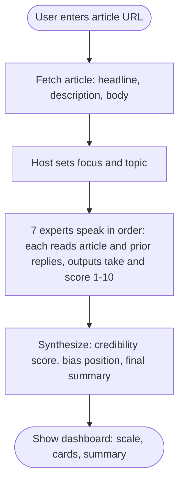
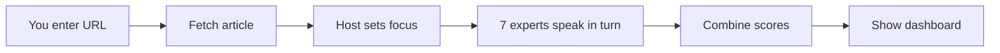

# How Polarity Works

The live app lives under **`frontend/`** in this monorepo ([polarity-v2 layout](https://github.com/pthaps/polarity-v2)).

**One sentence:** You give us a news link; our AI panel debates it and gives you a simple bias and reliability score.

---

## The Big Picture

- You paste a news article URL.
- We fetch and read the article.
- A **Host** sets the topic; then **7 AI experts** give short opinions in order.
- We combine their scores into one result: reliability, bias position, and a short summary.
- You see an easy-to-read dashboard (scale, cards, summary).

---

## Workflow Diagram

**Simple flow (left to right):**

---

## Step-by-Step

### Step 1 – You enter a link

You paste the article URL and click **Analyze**.

### Step 2 – We read the article

Our system visits the page and pulls out the headline, description, and main text.

### Step 3 – The Host kicks off

One AI **Host** reads the article and writes a short note: *"Today we're looking at…"* so everyone stays on topic.

### Step 4 – Seven experts speak in order

Each expert sees the article and what the previous experts said, then gives a short take and a score from 1–10.

### Step 5 – We combine the results

Another AI reads all 7 summaries and scores and produces: one reliability score, a bias label (e.g. Left / Center / Right), and a short final summary.

### Step 6 – You see the dashboard

One screen: bias scale, reliability and bias cards, key factors, and the summary.

---

## Who Are the 7 Experts?

| Name     | Role                          |
|----------|-------------------------------|
| Morgan   | Champion of equality          |
| Victor   | Guardian of order             |
| Skeptica | Questions everything          |
| Lens     | Spots the spin                |
| Verify   | Evidence only                 |
| Bridge   | Finds common ground           |
| Terra    | Real-world impact             |

---

## What You Get at the End

- **Bias position** on a scale (e.g. Left, Center, Right)
- **Reliability score**
- **Neutrality index**
- **Warning signs** (what to watch out for)
- **Positive signals** (what the article does well)
- **Short summary** — all in one view

---

## Technical Note

Under the hood we use Google Gemini and fetch article content from the URL; outlet baselines come from the Ad Fontes chart data; optional storage in Supabase.
