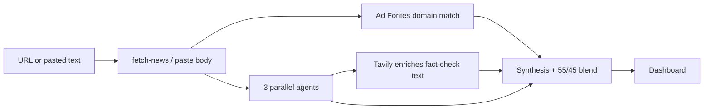

# How Polarity Works

The live app lives under **`frontend/`** in this monorepo ([polarity-v2](https://github.com/pthaps/polarity-v2)).  
Canonical product + architecture detail: **[MASTER_PLAN.md](./MASTER_PLAN.md)**.

**One sentence:** You give a URL or pasted text; **three AI analysts** read the same article **in parallel**; a **fourth synthesis** pass turns their outputs into blended scores (AI + Ad Fontes) and a summary; optional **Tavily** enriches fact-check sources with live URLs.

---

## The Big Picture

1. You paste a **URL** (or switch to **paste text** for paywalled pages).
2. We **fetch** headline, description, and body (truncated for token limits).
3. We look up an **Ad Fontes–style** outlet baseline by domain.
4. **Three agents** run **at the same time** (Bias, Fact-Checker, Synthesizer) — each sees the article cold, no peer agent text in that pass.
5. A **synthesis** Gemini call reads only **short summaries/scores** from those three and emits numeric scores + final summary; **Tavily** may run alongside to enrich claim sources.
6. Scores are **blended 55% AI / 45% outlet** historical data.
7. You see the **dashboard**: spectrum, cards, analyst panels, claims, feedback.

---

## Workflow Diagram

---

## The three panel agents (code)

| ID | Role |
|----|------|
| `bias` | Loaded language & framing (**Lens**); outputs `KEYWORDS` |
| `factchecker` | Claims with **CLAIM / VERDICT / SOURCE** blocks (**Verify**) |
| `synthesizer` | Overall reliability & balance (**Bridge**) |

The **final** Gemini call does **not** see full agent essays — only compact summaries/scores — then produces credibility, horizontal estimate, neutrality sub-scores, and `FINAL_SUMMARY`.

---

## What you get

- **Bias category** (five buckets) and **credibility score (0–100)**
- **Keyword** highlights (bias agent) and **claim** rows with verdicts
- **Optional** real URLs on sources when Tavily is configured
- **Summary** and **sub-metrics** (political / language / coverage neutrality)
- **Feedback** (thumbs + comment) with Supabase + CSV fallback

---

## Chrome extension

The extension runs the **same** `fetch-news` → `analyze` pipeline once, then can open the full site with the result **hydrated** via `sessionStorage` so the web UI does not analyze again. See **[../extension/README.md](../extension/README.md)**.
